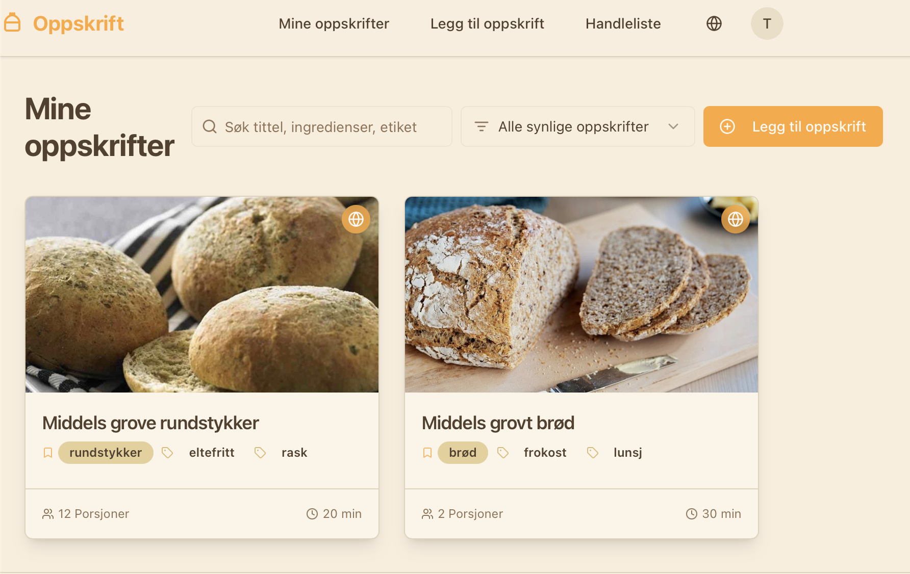

# Oppskrift - Your Personal Recipe Book

Oppskrift is a modern, web-based application designed to help you manage your personal recipe collection with ease. Built with Next.js and Prisma, it offers a streamlined experience for creating, viewing, editing, and organizing your favorite recipes.

## Screenshot


*The main recipe listing page in Oppskrift, displaying user's recipes with search and filtering capabilities.*

## Key Features

*   **Recipe Management:** Add, view, edit, and delete your personal recipes. Recipes can be marked as public (visible to all users, even unauthenticated) or private (visible only to the creator).
*   **Rich Recipe Details:** Store ingredients, multi-step instructions, serving sizes, prep/cook times, categories, and tags.
*   **AI-Powered Recipe Import (Text/URL):** Paste raw recipe text or a URL into the recipe form, and an AI agent (powered by Genkit) will attempt to parse the content and automatically populate the form fields. The AI uses the currently selected UI language as a guide for parsing.
*   **AI-Powered Recipe Import (Image OCR):** Upload an image of a recipe (or drag-and-drop), and the AI will perform Optical Character Recognition (OCR) to extract text, then parse that text to populate the recipe form. This feature also uses the selected UI language to guide the AI.
*   **AI-Powered Image Suggestions:** Get relevant image suggestions for your recipes based on their titles, powered by Genkit and Gemini. Images are stored as data URIs after client-side resizing. (Note: Image generation availability may be subject to regional restrictions by the model provider, as is currently the case for Norway/EU with `gemini-2.0-flash-exp`).
*   **Star Rating System:** Users can rate public recipes (and owners their own private recipes) on a 1-5 star scale. Average ratings and vote counts are displayed. Users can also clear their vote.
*   **Dynamic Ingredient Scaling:** Adjust serving sizes on the fly, and ingredient quantities will scale automatically.
*   **Shopping List:** Add ingredients from recipes to a consolidated shopping list.
*   **Filtering & Searching:** Easily find recipes by searching titles, descriptions, ingredients, categories, or tags. Filter by visibility (public, private, community).
*   **User Authentication:** User accounts stored in a local SQLite database. Includes profile editing (name, email, password).
*   **User Approval System:** New users require admin approval before they can create recipes or rate others' public recipes.
*   **Persistent Storage:** Recipe data is stored in an SQLite database. 
*   **Import/Export:** Users can export their recipes to a JSON file and import recipes from a JSON file. HTML and Markdown export for individual and all user recipes.
*   **Internationalization (i18n):** Supports multiple languages (English, Norwegian, Spanish).
*   **Responsive Design:** Built with ShadCN UI components and Tailwind CSS for a clean experience on all devices.
*   **Admin Functionality:** A designated admin user (defined in `prisma/seed.ts`) can delete any recipe in the system and approve new users.

## Tech Stack

*   **Frontend:** Next.js (App Router), React, TypeScript
*   **Styling:** Tailwind CSS, ShadCN UI
*   **Backend & Database:** NextAuth.js, Prisma (SQLite)
*   **AI Integration:** Genkit (using Google Gemini models)
*   **Internationalization:** `i18next` pattern with JSON locale files (adapted for a simpler context-based approach).
*   **Drag & Drop:** `@hello-pangea/dnd` for reordering ingredients and steps.

## Getting Started

This application is designed for easy self-hosting. Follow the steps below to get started.

To explore the app, take a look at the main page component located at `src/app/page.tsx`.

### Environment Variables

To enable full functionality, especially AI-powered features, you may need to configure the following environment variables. Create a `.env.local` file in the root of your project (if it doesn't already exist) and add the necessary variables.

```
# .env.local

# Optional: Your Google Gemini API Key for AI features (e.g., recipe parsing, image suggestions).
# If not provided, AI features will be disabled.
# Get your key from Google AI Studio: https://aistudio.google.com/app/apikey
GEMINI_API_KEY=your_gemini_api_key_here
```

*   `GEMINI_API_KEY`: Your API key for accessing Google Gemini models. This is optional. If you do not provide this key, the AI-powered features (like AI-powered recipe import and image suggestions) will be disabled.
*   `NEXTAUTH_SECRET`: A random string used to hash tokens, sign/encrypt cookies, and generate a key for the NextAuth.js. You can generate a strong secret using `openssl rand -base64 32` or `openssl rand -hex 32`.
*   `NEXTAUTH_URL`: The base URL of your application (e.g., `http://localhost:3000` or `https://your-app.com`). This is used for callbacks and redirects.
*   `EMAIL_SERVER_HOST`: The hostname or IP address of your SMTP server.
*   `EMAIL_SERVER_PORT`: The port of your SMTP server (e.g., `587` for TLS/STARTTLS, `465` for SSL).
*   `EMAIL_SERVER_SECURE`: Set to `true` if your SMTP server uses SSL/TLS (usually port 465), `false` otherwise (usually port 587 with STARTTLS).
*   `EMAIL_SERVER_USER`: The username for authenticating with your SMTP server.
*   `EMAIL_SERVER_PASSWORD`: The password for authenticating with your SMTP server.
*   `EMAIL_FROM`: The email address that will appear as the sender for outgoing emails (e.g., password reset emails).


### Database Setup and Admin User Initialization

This project uses Prisma with SQLite for its database. On the first run, the database will be initialized, and a default admin user will be created.

To set up the database and create the admin user:

1.  **Install dependencies and run migrations/seed:**
    ```bash
    npm install
    ```
    This command will:
    *   Install all necessary Node.js dependencies.
    *   Run Prisma migrations to create the `dev.db` SQLite database file and define its schema.
    *   Execute the Prisma seed script (`prisma/seed.ts`). If no admin user exists, it will create one with the email `admin@example.com` and a randomly generated 8-character password. This password will be printed to your console during the `npm install` process.

2.  **Start the development server:**
    ```bash
    npm run dev
    ```

**Note:** If you ever need to reset your database (e.g., for development purposes), you can delete the `prisma/dev.db` file and run `npm install` again.

**Note on Hosting with Google Firebase:** If you are interested in hosting this application using Google Firebase infrastructure, please refer to `v1.0` of this repository, which was specifically designed for that environment.
